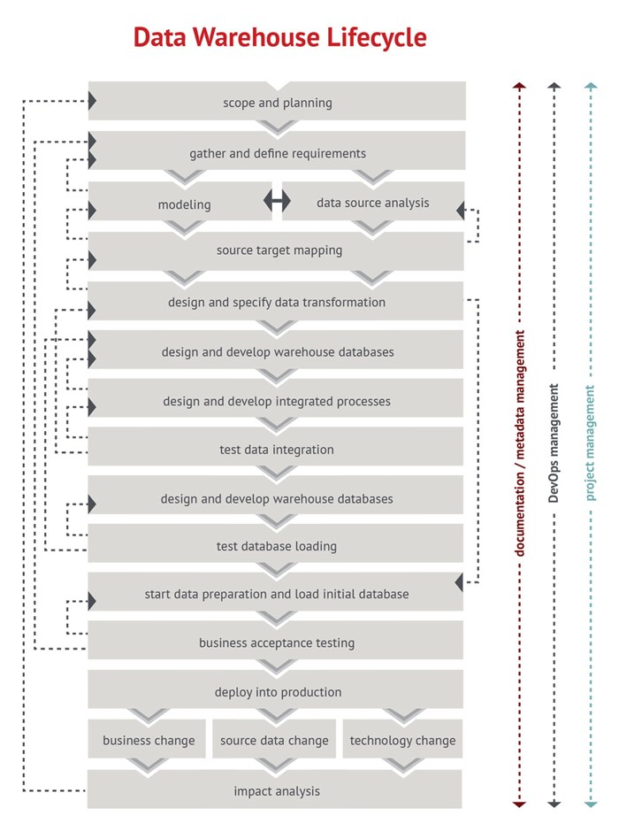

# Business Intelligence and Data Warehouse Course

## Session 4

The topic of this session is **Data Modelling** (in particular, data warehouse modelling). This repository includes the content discussed in class:

  - Datasets
  - Videos

## Main Concepts

  - Data Warehouse design and implementation

## How to use this content

  - Watch the videos
  - If you want to reproduce download the dataset (sakila-dwh) and install the programs
  - Required Software:
	  - MySQL
	  - MySQL Workbench
  - All schemas have been created with MySQL Workbench.
  
## What you can learn in the videos

  - [Loading the Sakila Data Warehouse](https://vimeo.com/242391229)
  - [MySQL Workbench - Publishing a Schema](https://vimeo.com/234888753)
  
## FAQ

### How to choose between CIF, MD or Data Vault?

  - CIF (Inmon)
  	- Easy to maintain
  	- Structured
  	- Easier data mining
  	- Timely to build
  - MD (Kimball)
	  - Start small, scale big
	  - Faster ROI
	  - Analytical Tools
	  - Low reusability
  - Data Vault (Lyndsted)
	  - Backend Data Warehouse
	  - Multiple sources; Full history; Incremental build
	  - Up-front work; Long-term payoff; Many joins

### What can I do if I don't have access to the data yet?

You can generate random data to start working. For example, you can use [Mockaroo](https://www.mockaroo.com/)  or [GenerateData](http://generatedata.com).

Another option is to generate synthetic data. There are many differen approaches that can be categorized into three main groups: **synthetic reconstruction**, **combinatorial optimization**, and **model-based generation**.

Another option is to generate synthetic data. There are many differen approaches that can be categorized into three main groups: synthetic reconstruction, combinatorial optimization, and model-based generation.

### Is there a data warehouse lifecycle?

Yes. It comprises many iterative steps.

